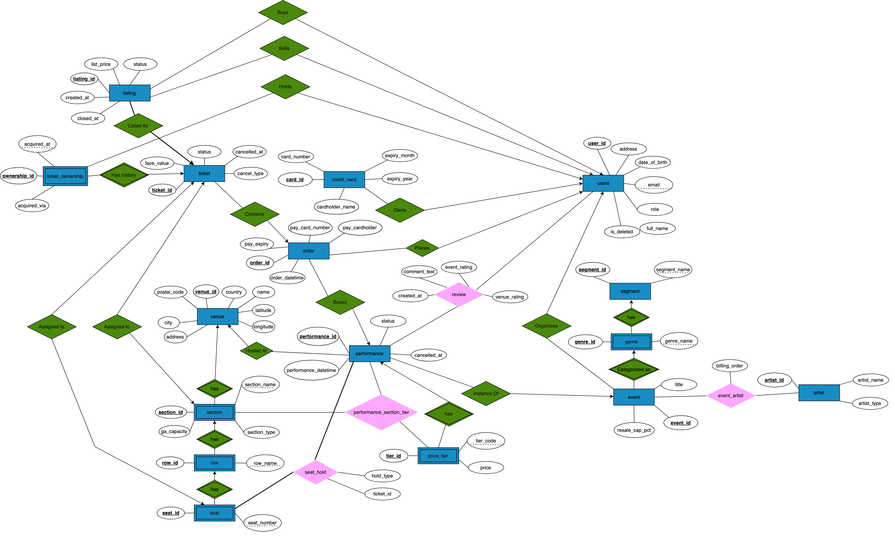

# MyTix - Project Report

CSCC43 Database Design Project

**Group members**
- Tareq Abousherif (1007977824)
- Faris Shabaytah (1011300986)


## 1. Purpose

MyTix is a Ticketmaster-style ticketing platform. Organizers create events and
schedule performances at venues; they define price tiers, assign seating sections
to those tiers, block seats, and cancel performances. Customers search for
performances, book reserved seats or general-admission tickets, cancel within the
rules, resell tickets under a price cap, and review shows they attended. On top of
this the system answers seven search queries, nine periodic reports, and an
organizer pricing toolkit.

The database is the core of the system. This report covers the conceptual problems
we hit while modelling the domain, the assumptions we made, the ER design, the
relational schema and its keys, the functional dependencies, the normal-form
justification for each relation, and the DDL.


## 2. Conceptual problems and how we solved them

**Section-to-tier pricing is per performance.** The same physical
section can be premium one night and standard the next, and a touring event plays
different venues. So the tier assignment is keyed by `(performance_id, section_id)`
in `performance_section_tier`, and price tiers belong to a performance, not a
venue. Anchoring pricing on the venue or the section would make re-priced nights
and tours impossible to represent.

**Live seat inventory is derived, not materialized.** We do not keep an
AVAILABLE/SOLD/BLOCKED row per (performance, seat). A reserved seat is available
when it has no `seat_hold` row for that performance. `seat_hold(performance_id,
seat_id, hold_type, ticket_id)` has a primary key of `(performance_id, seat_id)`,
which makes double-selling impossible at the schema level: a seat can hold at most
one SOLD or BLOCKED row per performance. GA has no seats, so it sells against a
capacity count instead. Cancelling a ticket deletes its hold, which returns the
seat to the available pool automatically, so availability is always correct without
a second place to keep in sync.

**One section table with a type flag.** Reserved and general-admission sections are
the same structural thing (a named area of a venue), so a single `section` table
carries a `section_type` flag and a nullable `ga_capacity`, rather than two subtype
tables. This keeps `section_id` a single foreign-key target and makes "is this GA?"
a cheap column read for search, the seat map, and booking. A check ties
`ga_capacity` to the type.

**Geography and taxonomy stay normalized.** City, country, postal code, and address
live on `venue`, never on `performance`: we have `performance_id -> venue_id` and
`venue_id -> city`, so storing city on a performance would embed a transitive
dependency and break 3NF. Likewise an event points at a `genre` only, never a
`segment`; the segment is reached through `genre -> segment`. Storing both on the
event would allow contradictory rows such as genre Rock under segment Sports.

**BCNF everywhere except this relation (3NF).** In `performance_section_tier`, the
dependency `tier_id -> performance_id` holds with a non-superkey left side (one tier
covers many sections, so `tier_id` repeats), which breaks BCNF. We keep the relation
in 3NF on purpose: the BCNF decomposition drops `performance_id`, which loses the
"exactly one tier per section per performance" key and breaks the composite foreign
key that ties an assignment to a tier of the same performance. This is a textbook
case of BCNF costing a dependency that 3NF preserves, which is our reasoning behind choosing 3NF.

**A ticket reaches its performance through its order.** A ticket does not store
`performance_id`. Its order does (`orders.performance_id`), and a ticket belongs to
exactly one order, so the performance is one join away. Storing `performance_id` on
the ticket as well would introduce the transitive dependency
`order_id -> performance_id` and drop the ticket below 3NF for no benefit.

**Prices change but sold ticket prices do not.** A tier's `price` can be updated, but each ticket
freezes its `face_value` at sale time. Past sales never shift when a tier is
repriced, and the rule "no price change once a tier has sold a ticket" is enforced
in the application because it depends on live sales data.

**Payment is a snapshot.** An order stores the card number,
cardholder, and expiry actually used (`pay_*`), rather than a foreign key to
`credit_card`. Pointing at the card row would break 3NF (card details would depend
on `card_id`, not the order) and would also rewrite payment history if the customer
later edited or deleted that card. The snapshot keeps each order in BCNF and
preserves what was charged.

**Ownership is an append-only log; resale is not considered an order.** `ticket_ownership`
gets one row at purchase and one per resale, and the current owner is the row with
the latest `acquired_at`. We do not cache a `current_owner_id`, which would be a
cross-table copy that can drift. A resale flips a `listing` to SOLD and appends a
RESALE ownership row; it creates no `orders` row, since the primary market and the
peer-to-peer resale market are different things and reports such as "number of
orders" mean primary sales.

**Cancellation is recorded in place and refunds are implied.** A ticket carries
`status` and `cancel_type` (CUSTOMER or PERFORMANCE), and a performance carries
`status` and `cancelled_at`. The link is strictly one-to-one and optional, so a
separate cancellation table would add joins and a second consistency surface without
raising the normal form. No payment is modelled, so a cancellation is a full
face-value refund and the cancelled ticket is the refund record.

**Reviews are keyed by (customer, performance).** "At most one review per
performance attended" is `UNIQUE(customer_id, performance_id)`. One review carries
both the event and the venue rating, since a performance has exactly one of each,
and the event and venue are reached by join rather than duplicated.


## 3. Assumptions

- A user is either a customer or an organizer, not both (`role`), which keeps sign-in
  and the two operation sets cleanly separated.
- An event's artist lineup and billing order are constant across its performances.
  The specification defines billing at the event level and never asks for
  per-performance openers.
- Refunds are not modelled as payments: a cancellation implies a full refund of the
  ticket's face value, and the CANCELLED ticket is the refund record.
- Buying a resale listing is a peer-to-peer transfer, not an order, so it creates no
  `orders` row and does not count toward primary-market order reports.
- The right to cancel a ticket follows its current owner (who holds it and receives
  the refund), which correctly handles tickets that were resold.
- "Recently attended," for review eligibility, means within the past year, matching
  the rolling one-year windows used by the reports.
- Gross revenue and sell-through count active tickets only; a cancelled ticket was
  refunded and its seat is back in the pool.


## 4. ER diagram



The diagram gives entity sets, their attributes, primary keys, and the relationships
among them (venue to section to row to seat; event to performance; the pricing and
booking chains; resale, ownership, and reviews).


## 5. Relational schema and keys

Primary keys are underlined in intent by `PK`; `UNIQUE` marks the other candidate
keys; `FK` marks foreign keys.

```
users(user_id, full_name, address, email, date_of_birth, role, is_deleted)
  PK user_id            UNIQUE(email)

credit_card(card_id, customer_id, card_number, cardholder_name, expiry_month, expiry_year)
  PK card_id            FK customer_id -> users

venue(venue_id, name, latitude, longitude, address, postal_code, city, country)
  PK venue_id

section(section_id, venue_id, section_name, section_type, ga_capacity)
  PK section_id         UNIQUE(venue_id, section_name)   FK venue_id -> venue

seat_row(row_id, section_id, row_name)
  PK row_id             UNIQUE(section_id, row_name)     FK section_id -> section

seat(seat_id, row_id, seat_number)
  PK seat_id            UNIQUE(row_id, seat_number)      FK row_id -> seat_row

segment(segment_id, segment_name)
  PK segment_id         UNIQUE(segment_name)

genre(genre_id, segment_id, genre_name)
  PK genre_id           UNIQUE(segment_id, genre_name)   FK segment_id -> segment

artist(artist_id, artist_name, artist_type)
  PK artist_id

event_artist(event_id, artist_id, billing_order)
  PK (event_id, artist_id)   FK event_id -> event, artist_id -> artist

event(event_id, organizer_id, title, genre_id, resale_cap_pct)
  PK event_id           FK organizer_id -> users, genre_id -> genre

performance(performance_id, event_id, venue_id, performance_datetime, status, cancelled_at)
  PK performance_id     FK event_id -> event, venue_id -> venue

price_tier(tier_id, performance_id, tier_code, price)
  PK tier_id            UNIQUE(performance_id, tier_code), UNIQUE(performance_id, tier_id)
                        FK performance_id -> performance

performance_section_tier(performance_id, section_id, tier_id)
  PK (performance_id, section_id)   FK section_id -> section,
                                    FK (performance_id, tier_id) -> price_tier(performance_id, tier_id)

orders(order_id, customer_id, performance_id, order_datetime, pay_card_number, pay_cardholder, pay_expiry)
  PK order_id           FK customer_id -> users, performance_id -> performance

ticket(ticket_id, order_id, seat_id, ga_section_id, face_value, status, cancelled_at, cancel_type)
  PK ticket_id          FK order_id -> orders, seat_id -> seat, ga_section_id -> section

seat_hold(performance_id, seat_id, hold_type, ticket_id)
  PK (performance_id, seat_id)   FK performance_id -> performance, seat_id -> seat, ticket_id -> ticket

ticket_ownership(ownership_id, ticket_id, owner_id, acquired_at, acquired_via)
  PK ownership_id       UNIQUE(ticket_id, acquired_at)   FK ticket_id -> ticket, owner_id -> users

listing(listing_id, ticket_id, seller_id, list_price, status, created_at, closed_at, buyer_id)
  PK listing_id         UNIQUE(active_listing_key)   FK ticket_id -> ticket, seller_id/buyer_id -> users

review(review_id, customer_id, performance_id, event_rating, venue_rating, comment_text, created_at)
  PK review_id          UNIQUE(customer_id, performance_id)   FK customer_id -> users, performance_id -> performance
```


## 6. Functional dependencies

Nontrivial FDs per relation (surrogate-key dependencies and the natural candidate
keys they coexist with):

```
venue_id                 -> name, latitude, longitude, address, postal_code, city, country
section_id               -> venue_id, section_name, section_type, ga_capacity
(venue_id, section_name) -> section_id
row_id                   -> section_id, row_name
(section_id, row_name)   -> row_id
seat_id                  -> row_id, seat_number
(row_id, seat_number)    -> seat_id

segment_id               -> segment_name
genre_id                 -> segment_id, genre_name
artist_id                -> artist_name, artist_type
(event_id, artist_id)    -> billing_order
event_id                 -> organizer_id, title, genre_id, resale_cap_pct
performance_id           -> event_id, venue_id, performance_datetime, status, cancelled_at

tier_id                      -> performance_id, tier_code, price
(performance_id, tier_code)  -> tier_id
(performance_id, section_id) -> tier_id
tier_id                      -> performance_id   (inside performance_section_tier)

user_id                  -> full_name, address, email, date_of_birth, role, is_deleted
email                    -> user_id
card_id                  -> customer_id, card_number, cardholder_name, expiry_month, expiry_year
order_id                 -> customer_id, performance_id, order_datetime, pay_card_number, pay_cardholder, pay_expiry
ticket_id                -> order_id, seat_id, ga_section_id, face_value, status, cancelled_at, cancel_type

(performance_id, seat_id) -> hold_type, ticket_id
ticket_id                 -> performance_id, seat_id   (for SOLD holds; a 2nd candidate key of seat_hold)

ownership_id             -> ticket_id, owner_id, acquired_at, acquired_via
(ticket_id, acquired_at) -> owner_id, acquired_via
listing_id               -> ticket_id, seller_id, list_price, status, created_at, closed_at, buyer_id
review_id                -> customer_id, performance_id, event_rating, venue_rating, comment_text, created_at
(customer_id, performance_id) -> event_rating, venue_rating, comment_text, created_at
```


## 7. Normal form

Every relation is in BCNF except `performance_section_tier`, which we keep in 3NF on
purpose. In each BCNF relation the only nontrivial dependencies are the candidate
keys themselves (a surrogate id and, where one exists, a natural unique key), so
every determinant is a superkey and there is nothing left to decompose. We designed
directly to this form rather than decomposing a wide relation:

- Geography and taxonomy are separated to avoid transitive dependencies: city and
  country live on `venue`, not `performance`, and segment is reached through
  `genre`, not stored on `event` (both would otherwise be `X -> Y -> Z` transitive
  dependencies breaking 3NF).
- A ticket carries no `performance_id`; it reaches the performance through its
  order, avoiding the transitive dependency `order_id -> performance_id`.
- An order snapshots the card used instead of referencing `credit_card`, so card
  attributes do not depend on a non-key `card_id` inside the order.

`performance_section_tier(performance_id, section_id, tier_id)` has candidate key
`(performance_id, section_id)`, and the extra dependency `tier_id -> performance_id`
holds because a tier belongs to one performance while covering many sections. That
determinant is not a superkey, so the relation is not in BCNF. It is in 3NF because
`performance_id` is prime (part of the candidate key). The BCNF decomposition would
split it into `(section_id, tier_id)` and `(tier_id, performance_id)`, which is not
dependency-preserving: it loses the key `(performance_id, section_id) -> tier_id`
that enforces "exactly one tier per section per performance," and it breaks the
composite foreign key `(performance_id, tier_id) -> price_tier`. We keep 3NF so the
database, not the application, enforces both rules.


## 8. DDL

The complete schema is created by `sql/schema.sql` in a single execution on
MySQL 8, with all types, primary/foreign keys, unique constraints, and check
constraints. It is reproduced below.

<!-- BUILD: inline sql/schema.sql here as a fenced ```sql block at PDF generation. -->
